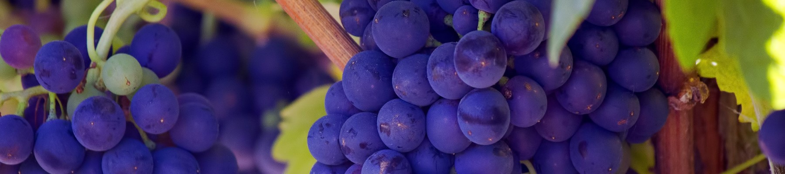

# 🐼Learning-Pandas

Learning Pandas from [Kaggle wine reviews dataset](https://www.kaggle.com/datasets/zynicide/wine-reviews)

## 🍇 Grouping and Sorting
[kaggle learn- Grouping and Sorting](https://www.kaggle.com/code/residentmario/grouping-and-sorting)

Start from jupyter notebook `grouping_and_sorting.ipynb`
### Table of content
1. `groupby()` usage
2. Multi-indexes `groupby()`
3. Sorting

## 🗺️ Summary Functions and Map 
Start from jupyter notebook `summary_and_maps.ipynb`
### Table of content
1. SUmmary functions `describe()`
2. Maps `map()`
3. Missing Data (and replace it!)

## 🧑‍🎓 30 Days of Pandas study plan
you'll learn from basic data operations like handling missing values to more intermediate concepts like conducting statistical calculations.

Topic including: Data Filtering, String Methods, Data Manipulation, Statistics, Data Aggregation and Data integration.

Start from running `Pandas_30days.ipynb`